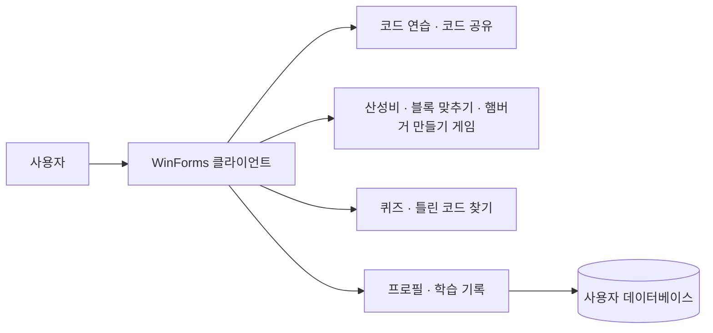

# WinForm Team3

> 코드 연습과 게임을 결합한 C/C++ 학습용 Windows 데스크톱 애플리케이션

## 프로젝트 소개

WinForm Team3는 프로그래밍을 처음 배우는 사용자가 코드를 반복해서 읽고 입력하며 자연스럽게 문법에 익숙해질 수 있도록 만든 게임형 코딩 학습 플랫폼입니다.

일반적인 코드 학습 프로그램처럼 문제를 풀기만 하는 것이 아니라, 코드 타이핑 연습과 실시간 대전, 미니게임, 코드 공유 기능을 하나의 WinForms 애플리케이션 안에서 제공합니다. 사용자는 연습 결과와 게임 기록을 프로필에서 확인하며 자신의 학습 과정을 관리할 수 있습니다.

## 주요 기능

### 코드 연습

- C/C++ 예제 코드를 직접 따라 입력하며 문법과 코드 구조를 익힐 수 있습니다.
- 입력 과정에서 타수와 정확도를 실시간으로 측정합니다.
- 반복문, 배열, 함수 등 난이도별 예제를 선택해 연습할 수 있습니다.
- 연습이 끝나면 결과가 사용자 기록에 반영됩니다.

### 코드 공유

- 자신이 작성한 코드를 제목, 난이도, 설명과 함께 저장할 수 있습니다.
- 저장한 게시물을 공개하거나 비공개로 설정할 수 있습니다.
- 다른 사용자가 공개한 코드를 살펴보고 새로운 예제로 연습할 수 있습니다.
- 작성한 게시물은 수정하거나 삭제할 수 있습니다.

### 실시간 PVP

#### 코딩 퀴즈

최대 4명의 사용자가 동시에 참여하는 퀴즈 게임입니다. 모든 참가자가 같은 문제를 풀고, 정답 여부와 점수를 실시간으로 비교해 최종 순위를 결정합니다.

#### 틀린 코드 찾기

두 명의 사용자가 같은 코드를 보고 잘못된 부분을 먼저 찾아내는 대전 게임입니다. 정답을 찾은 위치와 점수를 서버에서 공유하며 승리, 패배, 무승부 결과를 결정합니다.

### 미니게임

#### 산성비

C/C++ 키워드가 화면 위에서 떨어지면 사라지기 전에 정확하게 입력하는 타이핑 게임입니다. 게임이 진행될수록 난이도가 높아지며 최고 점수와 도달 레벨이 기록됩니다.

#### 블록 맞추기

일부가 비어 있는 코드를 보고 알맞은 코드 조각을 순서대로 완성하는 게임입니다. 문제를 모두 해결하는 데 걸린 시간을 기록해 자신의 최고 기록에 도전할 수 있습니다.

#### 햄버거 만들기 게임

햄버거 주문에 맞춰 재료와 동작 블록을 조합하는 블록 코딩 게임입니다. 재료 올리기, 패티 굽기, 기다리기, 반복하기, 조립하기 명령을 순서대로 배치하면 프로그램이 명령을 해석해 햄버거를 완성합니다.

반복문과 순차 실행 같은 프로그래밍 개념을 시각적으로 경험할 수 있도록 구성했습니다.

## 사용자 기록

사용자는 홈 화면에서 다음 정보를 확인할 수 있습니다.

- 닉네임과 프로필 이미지
- 주로 학습하는 프로그래밍 언어
- 코드 타이핑 속도와 정확도
- 산성비 최고 점수와 최고 레벨
- 블록 맞추기 최단 기록
- 퀴즈 최고 점수와 승률
- 틀린 코드 찾기 최근 전적

프로필과 주 언어는 환경설정에서 변경할 수 있으며, 학습과 게임 결과는 계정별로 저장됩니다.

## 서비스 구성

클라이언트는 화면과 게임 진행을 담당하고, 서버는 사용자 정보 저장과 실시간 참가자 매칭 및 점수 동기화를 담당합니다.

## 기술적 특징

- C# Windows Forms 기반 데스크톱 UI
- Guna UI를 활용한 사용자 인터페이스
- TCP 소켓을 이용한 실시간 멀티플레이 통신
- Microsoft SQL Server 기반 사용자·기록·게시물 관리
- 명령 블록을 해석해 실행하는 햄버거 게임 파서
- 사용자 세션과 네트워크 연결을 관리하는 싱글톤 구조

## 프로젝트의 목표

이 프로젝트는 코딩 학습을 반복적인 문제 풀이가 아닌 하나의 놀이 경험으로 만드는 것을 목표로 합니다. 혼자 코드를 따라 쓰고 기록을 높이거나, 다른 사용자와 대결하고 코드를 공유하면서 프로그래밍에 대한 흥미를 유지할 수 있도록 설계했습니다.

